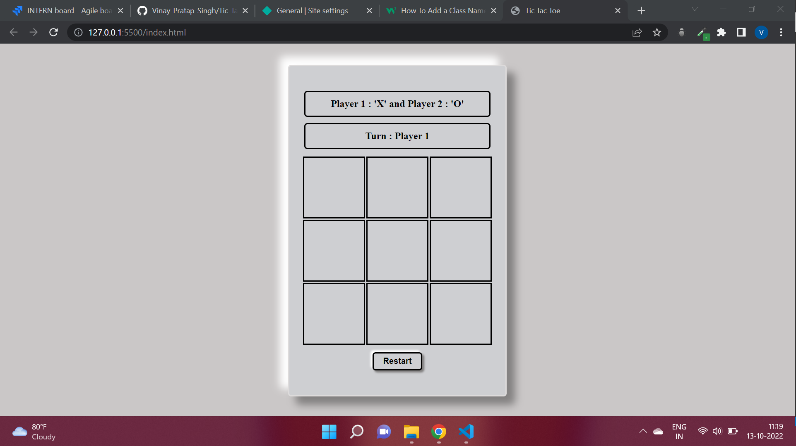

# **Overview of Tic-tac-Toe Project**
This project is all about one of the most  popular game in the web development community to enhance their developement skills, which is popularly known as the **Tic-Tac-Toe** game. 
In this game two players can play and compete with each other to win the game, if no one will be able to win the game the game will be draw. 
The game is compatible for both the PC and Mobile Screen sizes.

## **Technology Used**
1. HTML
2. CSS
3. Vanilla JS

## **Output**

## **Live Link**
If you want to check the game, hit that live link button and you will be redirected to the game page to enjoy. 

